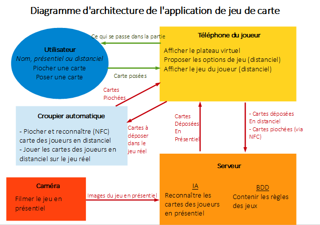

=== Schéma d’architecture

===== *Streaming Multimedia - Bloc Camera*

Afin de permettre l'analyse et la reconnaissance des cartes par vision par ordinateur, il est nécéssaire de communiquer un flux vidéo en continu.

===== *Intelligence artificielle*

Reconnaissance de motifs pour les cartes par vision par ordinateur.
Mise en oeuvre d'un moteur de jeu capable de jouer en autonomie permettant au croupier automatique d'agir comme un joueur indépendant. (option)

===== *Smartphone et tablette Android - Bloc téléphone*

Le(s) Joueur(s) à distance intéragissent à l'aide de leur(s) téléphone(s) via une application mobile.
Ce module permettra donc la conception de cette application.

===== *Communicaton Client Serveur*
 
Le projet fait intervenir à plusieurs reprises des liaisons sans fil. Le croupier automatique doit pouvoir communiquer avec le téléphone hôte de la partie. Par ailleurs les téléphones devront commnuniquer avec un serveur sur lequel seront stockées toutes les informations nécéssaires au bon déroulement de la partie et également les moteurs IA si ceux-ci ne peuvent être integrés à l'application.

===== *Conception et impression 3D - Bloc croupier*

Ce module permettra de concevoir et usiner les pièces et la structure du croupier.

===== *Raspberry pi - Bloc croupier*
 
L'utilisation d'une carte Raspberry pi permettra le contrôle du croupier et des éléments qui le composent.
 

